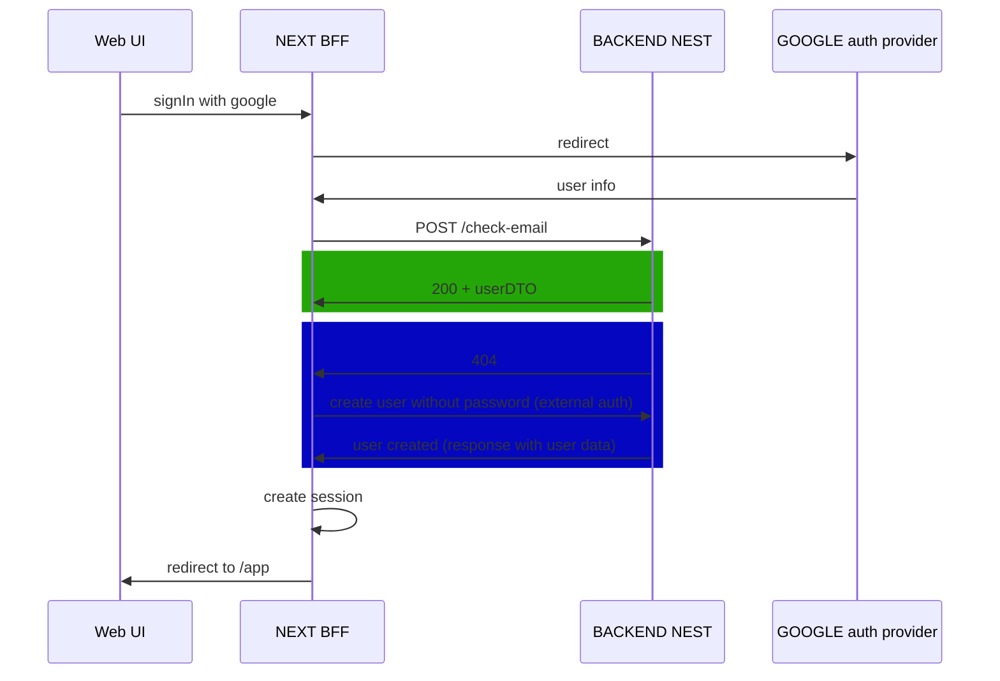
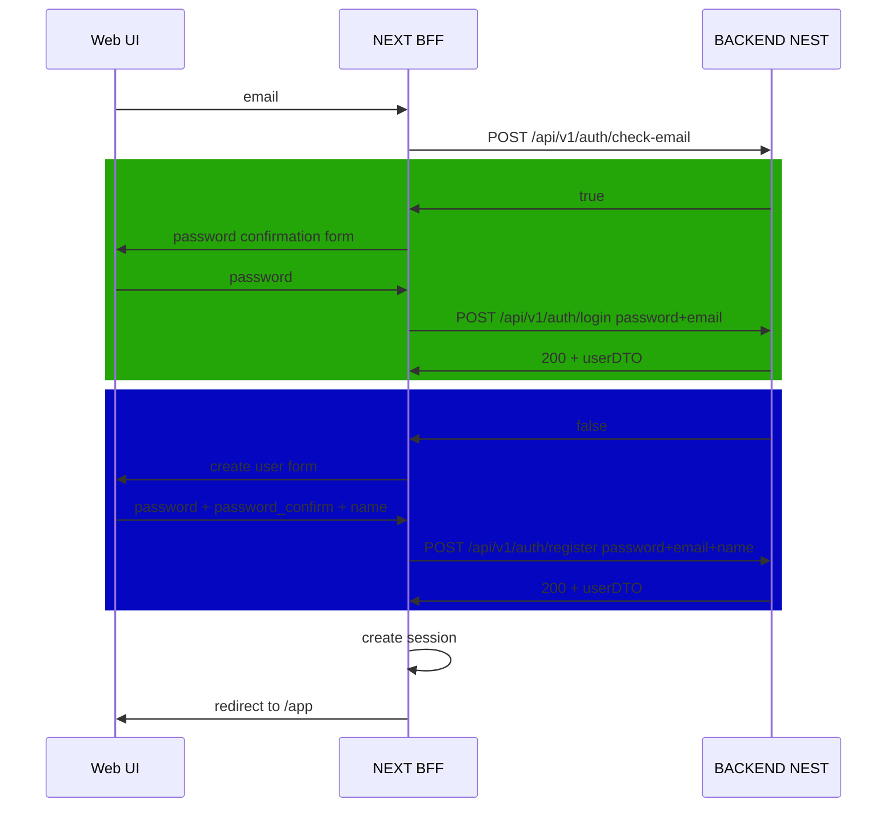

# Auth Docs

## Happy path

### Authentication with Google provider

```mermaid

sequenceDiagram

    participant UI as Web UI
    participant NEXT as NEXT BFF
    participant BE as BACKEND NEST
    participant GOOGLE as GOOGLE auth provider

    UI->>NEXT: signIn with google
    NEXT->>GOOGLE: redirect
    GOOGLE->>NEXT: user info
    NEXT->>BE: POST /check-email
    rect rgb(37, 166, 8)
    BE->>NEXT: 200 + userDTO
    end
    rect rgb(4, 7, 191)
    BE->>NEXT: 404
    NEXT->>BE: create user without password (external auth)
    BE->>NEXT: user created (response with user data)
    end
    NEXT->>NEXT: create session
    NEXT->>UI: redirect to /app

```

### Authentication with Credentials provider

```mermaid

sequenceDiagram

    participant UI as Web UI
    participant NEXT as NEXT BFF
    participant BE as BACKEND NEST

    UI->>NEXT: email
    NEXT->>BE: POST /api/v1/auth/check-email
    rect rgb(37, 166, 8)
    BE->>NEXT: true
    NEXT->>UI: password confirmation form
    UI->>NEXT: password
    NEXT->>BE: POST /api/v1/auth/login password+email
    BE->>NEXT: 200 + userDTO
    end
    rect rgb(4, 7, 191)
    BE->>NEXT: false
    NEXT->>UI: create user form
    UI->>NEXT: password + password_confirm + name
    NEXT->>BE: POST /api/v1/auth/register password+email+name
    BE->>NEXT: 200 + userDTO
    end
    NEXT->>NEXT: create session

    NEXT->>UI: redirect to /app

```
