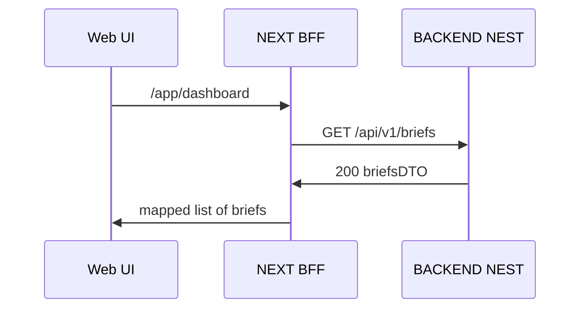
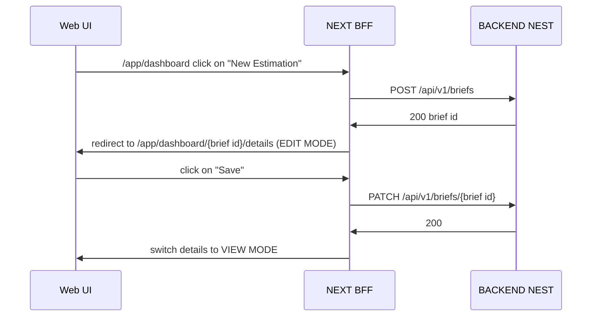
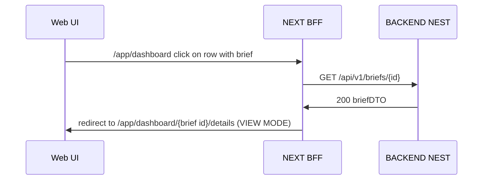

# Briefs

### List of Briefs (projects)

```mermaid

sequenceDiagram

    participant UI as Web UI
    participant NEXT as NEXT BFF
    participant BE as BACKEND NEST

    UI->>NEXT: /app/dashboard
    NEXT->>BE: GET /api/v1/briefs
    BE->>NEXT: 200 briefsDTO
    NEXT->>UI: mapped list of briefs

```
### Create Brief

```mermaid

sequenceDiagram

    participant UI as Web UI
    participant NEXT as NEXT BFF
    participant BE as BACKEND NEST

    UI->>NEXT: /app/dashboard click on "New Estimation"
    NEXT->>BE: POST /api/v1/briefs
    BE->>NEXT: 200 brief id
    NEXT->>UI: redirect to /app/dashboard/{brief id}/details (EDIT MODE)
    UI->>NEXT: click on "Save"
    NEXT->>BE: PATCH /api/v1/briefs/{brief id}
    BE->>NEXT: 200
    NEXT->>UI: switch details to VIEW MODE

```

### View Brief

```mermaid

sequenceDiagram

    participant UI as Web UI
    participant NEXT as NEXT BFF
    participant BE as BACKEND NEST

    UI->>NEXT: /app/dashboard click on row with brief
    NEXT->>BE: GET /api/v1/briefs/{id}
    BE->>NEXT: 200 briefDTO
    NEXT->>UI: redirect to /app/dashboard/{brief id}/details (VIEW MODE)

```
